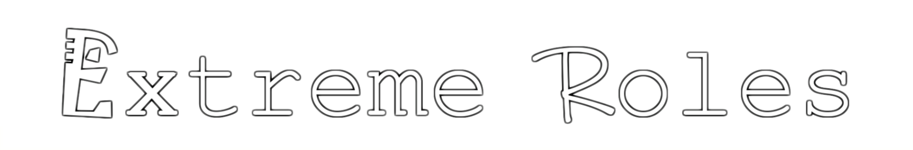
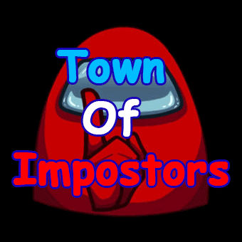

# 目录

- [前言](#前言)
  - [Among Us](#among-us)
  - [提醒](#提醒)
- [链接](#链接)
- [模组](#模组)
  - [1.TheOtherRoles](#1theotherroles-超多职业)
  - [2.TownOfUs-R](#2townofus-r-我们的小镇)
  - [3.Las Monjas](#3las-monjas-修道院)
  - [4.Nebula On The Ship](#4nebula-on-the-ship-星云舰)
  - [5.ExtremeRoles](#5extremeroles-极端职业)
  - [6.SuperNewRoles](#6supernewroles-超新职业)
  - [7.TheOtherUs](#7theotherus-我们的超多职业)
  - [8.TownOfHost](#8townofhost)
  - [9.TownOfHost-TheOtherRoles](#9townofhost--theotherroles)
  - [10.AllTheRoles](#10alltheroles)
  - [11.TownOfHost_Y](#11townofhost_y)
  - [12.TownOfUsReworked](#12townofusreworked)
- [旧模组](#旧模组)
  - [1.TownOfImpostors](#1townofimpostors)
  - [2.TownOfUs](#2townofus)
  - [3.Chess](#3Chess)
  - [4.Challenger](#4Challenger)
  - [5.Cursed-Among-Us](#5cursed-among-us)
  - [6.skeld.net](#6skeldnet)
  - [7.HarryPotter](#7HarryPotter)
  - [8.TheOtherRoles GM](#8theotherroles-gm)
  - [9.TheEpicRoles](#9theepicroles)
  - [10.Peasmod](#10peasmod)
  - [11.UltimateMods](#11UltimateMods)
  - [12.TheOtherRoles GM-Haoming](#12theotherroles-gm-haoming)
  - [13.Syyreth ModsAmongUs](#13syyreth-modsamongus)
  - [14.PropHunt](#14prophunt)
  - [15.TownOfLoonie](#15townofloonie)
  - [16.TownOfHost Plus](#16townofhost-plus)
  - [17.TheOtherRoles CE](#17theotherroles-ce)
  - [18.TownOfHostEdited](#18townofhostedited)
- [工具](#工具)
  - [１.BetterCrewLink](#１bettercrewlink)
  - [２.CrewLink](#２crewlink)
  - [３.ReplayInWindow](#３ReplayInWindow)
  - [４.ModManager](#４modmanager)
  - [５.Levelimposter-editor](#５levelimposter-editor)
  - [６.MultiClientInstancing](#６multiclientinstancing)
- [地图](#地图)
  - [１.Submerged](#１submerged)
  - [２.levelimposter](#２levelimposter)
- [多语言样式声明](#多语言样式声明)
  - [简体中文（SChinese）](#简体中文schinese)
  - [繁體中文（TChinese）](#繁體中文tchinese)
  - [Français（French）](#françaisfrench)
  - [English](#english)
  - [日本語（Japanese）](#日本語japanese)
  - [Русский（Russian）](#русскийrussian)
  - [Deutsch（German）](#deutschgerman)
  - [Español（Spanish）](#españolspanish)

# 前言

这是关于Among Us（中文译名：在我们之间，俗称：太空狼人杀）这款游戏的中文模组指南

###### Among Us

《Among Us》是一款由Innersloth制作发行的策略休闲游戏。

当您在飞船上前往您要去的地方时，可与4-15名玩家一起在线或通过局域网联机。但是要当心……因为船上可能有伪装者。一到三名船员已被伪装者所取代（内鬼）。他们的目标是在船返航前消灭其余船员。伪装者将破坏船只，潜入通风管道，欺骗其他人以保持自己安全并杀死船员。当每个人都在修理设施时，没有人可以保持匿名。一旦报告了尸体，幸存的船员将公开辩论他们认为“伪装者”是谁。伪装者的目的是假装他们是船员。如果不投票，则每个人都将继续维护该船，直到找到另一具尸体或召开紧急会议为止。如果伪装者被投票投出，那么船员将获胜。

###### 提醒

随着Among Us版本更新官方服务器所支持的服务器也在更新，过老版本只能使用私服才可游玩。
随着模组的职业越来越多，修改的东西也越来越多，容易触发树懒官方服务器的反作弊所以建议私服游玩。

# 链接

# 模组

<!-- 模板
## 序号.模组名

！[image](图片链接)  

[ GitHub仓库 ( 点这 ) ](仓库地址)  

最新版本：v  
Among Us 支持版本：  
更新状况：  

职业：

点评： -->

## 1.TheOtherRoles (超多职业)

  

[ GitHub仓库 ( 点这 ) ](https://github.com/TheOtherRolesAU/TheOtherRoles)  

最新版本：v4.3.2  
Among Us 支持版本：2023.3.28  
更新状况：持续更新中  

<!-- ### 职业

| Impostors         | 内鬼职业         | Crewmates      | 船员职业 | Crewmates   | 船员职业 |
| ----------------- | ---------------- | -------------- | -------- | ----------- | -------- |
| Evil Guesser      | 坏堵怪           | Nice Guesser   | 好赌怪   | Swapper     | 换票师   |
| Bounty Hunter     | 赏金猎人         | Detective      | 侦探     | Time Master | 时间之主 |
| Camouflager       | 隐蔽者           | Engineer       | 工程师   | Tracker     | 追踪者   |
| Cleaner           | 清洁工           | Hacker         | 黑客     | Medium      | 通灵师   |
| Eraser            | 抹除者           | Lighter        | 执灯人   | Portalmaker | 传送师   |
| Godfather (Mafia) | 教父（黑手党）   | Mayor          | 市长     |             |          |
| Mafioso (Mafia)   | 黑手党（黑手党） | Medic          | 医生     |             |          |
| Janitor (Mafia)   | 清洁工（黑手党） | Security Guard | 保安     |             |          |
| Morphling         | 变形者           | Seer           | 灵媒     |             |          |
| Trickster         | 骗术师           | Sheriff        | 警长     |             |          |
| Vampire           | 吸血鬼           | Deputy         | 捕快     |             |          |
| Warlock           | 术士             | Shifter        | 交换师   |             |          |
| Witch             | 女巫             | Snitch         | 告密者   |             |          |
| Ninja             | 忍者             | Spy            | 间谍     |             |          |
| Bomber            | 爆破手            |               |          |             |          |

| Neutral    | 中立职业 | Secondary     | 属性     | Gamemode     | 游戏模式 |
| ---------- | -------- | ------------- | -------- | ------------ | -------- |
| Jester     | 小丑     | Lover         | 恋人     | Classic      | 诸神之战 |
| Jackal     | 豺狼     | Mini          | 迷你船员 | Guesser      | 赌怪模式 |
| Sidekick   | 跟班     | VIP           | VIP      | Hide 'n Seek | 躲猫猫   |
| Vulture    | 秃鹫     | Bloody        | 溅血者   |              |          |
| Lawyer     | 律师     | Anti Teleport | 醉鬼     |              |          |
| Arsonist   | 纵火犯   | Tie Breaker   | 通讯兵   |              |          |
| Thier      | 小偷     | Sunglasse     | 太阳镜   |              |          |
| Pursuer    | 追随者   | Invert        | 破平者   |              |          |
| Prosecutor | 检察官   |               |          |              |          |
 -->
## 2.TownOfUs-R (我们的小镇)

  

[ GitHub仓库 ( 点这 ) ](https://github.com/eDonnes124/Town-Of-Us-R)  

最新版本：v4.0.6  
Among Us 支持版本：2023.3.28   
更新状况：持续更新中  

<!-- ### 职业  

| Crewmate Roles | 船员职业 | Neutral Roles  | 中立职业 | Impostor Roles | 内鬼职业 | Modifiers    | 附加属性 |
| -------------- | -------- | -------------- | -------- | -------------- | -------- | ------------ | -------- |
| Detective      | 侦探     | Amnesiac       | 失忆者   | Escapist       | 逃逸者   | Bait         | 诱饵     |
| Haunter        | 猎人     | Guardian Angel | 守护天使 | Grenadier      | 掷弹兵   | Blind        | 胆小鬼   |
| Investigator   | 调查员   | Survivor       | 幸存者   | Morphling      | 化形者   | Diseased     | 病人     |
| Mystic         | 灵媒     | Executioner    | 处刑人   | Swooper        | 隐身人   | Multitasker  | 多线程   |
| Seer           | 预言家   | Jester         | 小丑     | Poisoner       | 绝命毒师(4.0.1取消) | Torch        | 火炬     |
| Snitch         | 告密者   | Phantom        | 幻影     | Traitor        | 叛徒     | Button Barry | 执钮人   |
| Spy            | 间谍     | Arsonist       | 纵火犯   | Blackmailer    | 勒索者   | Flash        | 闪电侠   |
| Tracker        | 追踪者   | Plaguebearer   | 疫医     | Janitor        | 清理者   | Giant        | 巨人     |
| Trapper        | 陷阱师   | The Glitch     | 混沌     | Miner          | 管道工   | Radar        | 雷达     |
| Sheriff        | 警长     | Werewolf       | 豺狼     | Undertaker     | 送葬者   | Lovers       | 恋人     |
| Veteran        | 老兵     |                |          | Bomber         | 爆破手    | Sleuth       | 掘墓人   |
| Vigilante      | 警员     |                |          | Escapist       |  逃逸者    | Tiebreaker   | 破平者   |
| Altruist       | 殉道者   |                |          |                |          | Disperser    | 分散者   |
| Medic          | 医生     |                |          |                |          | Double Shot  | 专业刺客 |
| Engineer       | 工程师   |                |          |                |          | Underdog     | 潜伏者   |
| Mayor          | 市长     |                |          |                |          |              |          |
| Medium         | 通灵师   |                |          |                |          |              |          |
| Swapper        | 换票师   |                |          |                |          |              |          |
| Time Lord      | 时间之主(4.0.1取消) |                |          |                |          |              |          |
| Transporter    | 传送师   |                |          |                |          |              |          |
| Imitator       | 效颦者         |
-->
## 3.Las Monjas (修道院)

  

[ GitHub仓库 ( 点这 ) ](https://github.com/KiraYamato94/LasMonjas)  

最新版本：v3.1.7  
Among Us 支持版本：2023.3.28  
更新状况：持续更新中  

### 切换汉语

方式：进入房间，在聊天框内输入 `/language chinese`即可，可以简写为`/l chinese`  

### 游戏模式

| CaptureTheFlag | PoliceAndThiefs | KingOfTheHill | Hot Potato | Zombie Laboratory | Monja Festival |
| -------------- | --------------- | ------------- | ---------- | ----------------- | -------------- |
| 夺旗模式       | 警察抓小偷      | 山丘之王      | 烫手山芋   | 僵尸实验室        | 修女节         |

<!-- ### 职业

| Impostors   | 内鬼职业 | Crewmates      | 船员职业 | Crewmates   | 船员职业 |
| ----------- | -------- | -------------- | -------- | ----------- | -------- |
| Mimic       | 化形者   | Captain        | 船长     | Vigilant    | 哨兵     |
| Painter     | 隐蔽者   | Mechanic       | 工程师   | Hunter      | 猎人     |
| Demon       | 吸血鬼   | Sheriff        | 警长     | Jinx        | 扫把星   |
| Janitor     | 清理者   | Detective      | 侦探     | Coward      | 怯懦者   |
| Ilusionist  | 骗术师   | Forensic       | 法医     | Bat         | 蝙蝠侠   |
| Manipulator | 术士     | Time Traveler  | 时间之主 | Necromancer | 死灵法师 |
| Bomberman   | 炸弹人   | Squire         | 医生     | Engineer    | 机关师   |
| Chameleon   | 隐形人   | Cheater        | 换票师   | Shy         | 内敛者   |
| Gambler     | 赌怪     | Fortune Teller | 预言家   | Task Master | 代理人   |
| Sorcerer    | 女巫     | Hacker         | 黑客     | Jailer      | 狱卒     |
| Medusa      | 美杜莎   | Sleuth         | 追踪者   |             |          |
| Hypnotist   | 催眠师   | Fink           | 告密者   |             |          |
| Archer      | 弓箭手   | Kid            | 小孩     |             |          |
| Plumber     | 管道工   | Welder         | 焊接工   |             |          |
| Librarian   | 勒索者   | Spiritualist   | 殉道者   |             |          |

| Neutrals        | 中立职业 | Rebels        | 反叛者职业 | Modifiers      | 效果   |
| --------------- | -------- | ------------- | ---------- | -------------- | ------ |
| Joker           | 小丑     | Renegade      | 变节者     | Lovers         | 恋人   |
| Role Thief      | 交换师   | Bounty Hunter | 赏金猎人   | Lighter        | 执灯人 |
| Pyromaniac      | 纵火犯   | Trapper       | 陷阱师     | Blind          | 失明者 |
| Treasure Hunter | 寻宝猎人 | Yinyanger     | 阴阳师     | Flash          | 闪电侠 |
| Devourer        | 秃鹫     | Challenger    | 挑战者     | Big Chungus    | 巨人   |
| Poisoner        | 疫医     | Ninja         | 忍者       | The Chosen One | 诱饵   |
| Puppeteer       | 傀儡师   | Berserker     | 嗜血杀手   | Performer      | 广播员 |
| Exiler          | 处刑人   | Yandere       | 尾随者     | Pro            | 醉鬼   |
| Amuesiac        | 失忆者   | Stranded      | 探险者     | Paintall       | 彩弹人 |
| Seeker          | 寻找者   | Monja         | 修女       | Electrician    | 电工   |

千年隼号地图展示：  

## 4.Nebula On The Ship (星云舰)

  

[ GitHub仓库 ( 点这 ) ](https://github.com/Dolly1016/Nebula)  

最新版本：v2.3.1  
Among Us 支持版本：2023.3.28   
更新状况：可能停更（作者已发通知）

<!-- ### 职业

| Impostors     | 内鬼职业   | Crewmates    | 船员职业   | Neutral       | 中立职业   |
| ------------- | ---------- | ------------ | ---------- | ------------- | ---------- |
| Bounty Hunter | 赏金猎人   | Agent        | 代理人     | Arsonist      | 纵火犯     |
| Camouflager   | 隐蔽者     | Alien        | 外星人     | Avenger       | 复仇者     |
| Cleaner       | 清理者     | Bait         | 诱饵       | Empiric       | 疫医       |
| Damned        | 受诅咒者   | Busker       | 街头艺人   | Chain Shifter | 连环交换师 |
| Disturber     | 干扰者     | Comet        | 彗星之子   | Jackal        | 豺狼       |
| Eraser        | 抹除者     | Doctor       | 医学家     | Jester        | 小丑       |
| Evil Ace      | 密命王牌   | Guardian     | 特工       | Opportunist   | 投机者     |
| Evil Guesser  | 邪恶的赌怪 | Mayor        | 市长       | Sidekick      | 跟班       |
| Evil Trapper  | 邪恶陷阱师 | Navvy        | 修理工     | Vulture       | 秃鹫       |
| Jailer        | 狱卒       | Necromancer  | 死灵法师   |               |            |
| Marionette    | 木偶师     | Nice Guesser | 正义的赌怪 |               |            |
| Morphing      | 化形者     | Nice Trapper | 正义陷阱师 |               |            |
| Painter       | 画皮师     | Oracle       | 占卜师     |               |            |
| Raider        | 强盗       | Provocateur  | 挑衅者     |               |            |
| Reaper        | 送葬者     | Psychic      | 通灵师     |               |            |
| Sniper        | 狙击手     | Seer         | 灵媒       |               |            |
|               |            | Sheriff      | 警长       |               |            |
|               |            | Spy          | 卧底       |               |            |
|               |            | Madmate      | 叛徒       |               |            |

| Secondary | 附加职业 | Ghost       | 亡灵职业 |
| --------- | -------- | ----------- | -------- |
| Drunk     | 醉鬼     | Poltergeist | 捣蛋鬼   |
| Guesser   | 赌怪     |             |          |
| Lover     | 恋人     |             |          |
| Trilemma  | 三角恋   |             |          |
 -->
## 5.ExtremeRoles (极端职业)

[ GitHub仓库 ( 点这 ) ](https://github.com/yukieiji/ExtremeRoles)  

最新版本：v7.1.2.4  
Among Us 支持版本：2023.3.28  
更新状况：持续更新中  

## 6.SuperNewRoles (超新职业)

  

[Github仓库(点这)](https://github.com/ykundesu/SuperNewRoles)

最新版本：v1.7.2.0  
Among Us 支持版本：2023.3.28  
更新状况：持续更新中  

> 建议私服游玩

## 7.TheOtherUs (我们的超多职业)
  

[ GitHub仓库 ( 点这 ) ](https://github.com/SpexGH/TheOtherUs)  

最新版本：v1.2.7  
Among Us 支持版本：2023.2.28  
更新状况：持续更新  

<!-- ## 8.TheOtherRoles MR

[Github仓库(点这)](https://github.com/miru-y/TheOtherRoles-MR)

最新版本：v2.8.1  
Among Us 支持版本：2022.10.25  
更新状况：断更   -->

## 8.TownOfHost

  

[Github仓库(点这)](https://github.com/tukasa0001/TownOfHost)

最新版本：v5.0.0  
Among Us 支持版本：2023.3.28  
更新状况：持续更新中  

> 来自日本，只需要房主安装模组，所有人都可以一起玩

## 9.TownOfHost - TheOtherRoles

[Github仓库(点这)](https://github.com/music-discussion/TownOfHost-TheOtherRoles)

最新版本：v0.9.3.11b  
Among Us 支持版本：2023.2.28  
更新状况：持续更新中  

> TownOfHost 的分支，由来自各国的开发者共同开发，目前原主要开发者 [music-discussion](https://github.com/music-discussion) 几乎不再参与，来自韩国的 단풍잎 正在尝试开发新的 AmongUs Mod API

## 10.AllTheRoles

  

[Github仓库(点这)](https://github.com/Zeo666/AllTheRoles)  

最新版本：v0.10.3  
Among Us 支持版本：2023.3.28  
更新状况：持续更新中  

> 建议私服游玩  

## 11.TownOfHost_Y

[Github仓库(点这)](https://github.com/Yumenopai/TownOfHost_Y)  

最新版本：v412.9.1 
Among Us 支持版本：2023.3.28  
更新状况：即将停更（作者已发通知）  

> TownOfHost 的分支，来自日本，由一人开发。

<!--

## 13.AUModS

[Github仓库(点这)](https://github.com/AUModS/AUModS)  

最新版本：v23.2.28  
Among Us 支持版本：2023.2.28  
更新状况：持续更新中  

>  基于 TheOtherRoles 代码制作的模组，作者 tomarai 曾做过 TheOtherRole 的分支，TheOtherRole GM 就是基于他的 TheOtherRole 分支做的分支

## 14.TownOfSuper

[Github仓库(点这)](https://github.com/reitou-mugicha/TownOfSuper)  

最新版本：v1.3.1  
Among Us 支持版本：2022.10.25  
更新状况：停更

>  采用部分 TownOfHost 代码制成的功能性模组

## 15.Revolutionary-host-roles

  
[Github仓库(点这)](https://github.com/sansaaaaai/Revolutionary-host-roles)  

## 16.TheIdealShip
  
[Github仓库(点这)](https://github.com/TheIdealShipAU/TheIdealShip)  

最新版本：v0.3.5  
Among Us 支持版本：2023.2.28  
更新状况：停更摆烂  

> 天寸：我做的模组doge

-->

## 12.TownOfUsReworked

  

[Github仓库(点这)](https://github.com/AlchlcDvl/TownOfUsReworked)  

最新版本：v0.3.1  
Among Us 支持版本：2023.3.28  
更新状况：持续更新中  

<!-- 暂时注释，等出正式版再加

## 19.TownOfThem
  

[ GitHub仓库 ( 点这 ) ](https://github.com/JieGeLovesDengDuaLang/TownOfThem)  

最新版本：v  
Among Us 支持版本：  
更新状况：

-->

# 旧模组

## 1.TownOfImpostors

  

[ GitHub仓库 ( 点这 ) ](https://github.com/Town-of-Impostors/TownOfImpostors)  

最新版本：v2.0.8  
Among Us 支持版本：2021.6.15  
更新状况：断更  

### 职业

| Crewmate Team | 船员职业 | Impostor  | 内鬼职业 | Other Teams | 其他职业 | Modifiers | 其他效果 |
| ------------- | -------- | --------- | -------- | ----------- | -------- | --------- | -------- |
| Sheriff       | 警长     | Dragger   | 拖拽者   | Jester      | 小丑     | Lovers    | 恋人     |
| Doctor        | 医生     | Morphling | 变形者   | Arsonist    | 纵火犯   | Giant     | 巨人     |
| Agent         | 代理人   | Deceiver  | 欺骗者   |             |          | Tiny      | 迷你船员 |
| Detective     | 调查员   | Viper     | 毒蛇     |             |          | Nightowl  | 执灯人   |
| Plumber       | 管道工   | Sniper    | 狙击手   |             |          |           |          |
| Informant     | 告密者   |           |          |             |          |           |          |
| Trickster     | 诱饵     |           |          |             |          |           |          |
| Operative     | 特务     |           |          |             |          |           |          |
| Mayor         | 市长     |           |          |             |          |           |          |

## 2.TownOfUs

  

[ GitHub仓库 ( 点这 ) ](https://github.com/Anusien/Town-Of-Us)  
[最开始我们的小镇的GitHub仓库](https://github.com/slushiegoose/Town-Of-Us)  

最新版本：v3.1.1-非官方延续  
Among Us 支持版本：2021.12.15  
更新状况：断更  

### 职业

| Crewmate Roles | 船员职业 | Neutral Roles | 中立职业 | Impostor Roles | 内鬼职业 | Modifiers    | 附加属性 |
| -------------- | -------- | ------------- | -------- | -------------- | -------- | ------------ | -------- |
| Mayor          | 市长     | Jester        | 小丑     | Janitor        | 清洁工   | Torch        | 火炬     |
| Lovers         | 恋人     | Shifter       | 交换师   | Morphling      | 化形者   | Diseased     | 病人     |
| Sheriff        | 警长     | The Glitch    | 混沌     | Camouflager    | 隐蔽者   | Flash        | 闪电侠   |
| Engineer       | 工程师   | Executioner   | 处刑人   | Miner          | 管道工   | Tiebreaker   | 破平者   |
| Swapper        | 换票师   | Arsonist      | 纵火犯   | Swooper        | 俯冲者   | Drunk        | 醉鬼     |
| Investigator   | 调查员   | Phantom       | 幻影     | Underdog       | 潜伏者   | Giant        | 巨人     |
| Time Lord      | 时间之主 |               |          | Undertaker     | 送葬者   | Button Barry | 执钮者   |
| Medic          | 医生     |               |          | Teleporter     | 传送者   | Coroner      | 掘墓人   |
| Seer           | 预言家   |               |          | Concealer      | 隐身人   | Carnivore    | 掘墓内鬼 |
| Spy            | 间谍     |               |          | Grenadier      | 掷弹兵   |              |          |
| Snitch         | 告密者   |               |          |                |          |              |          |
| Altruist       | 殉道者   |               |          |                |          |              |          |
| Prophet        | 侧写师   |               |          |                |          |              |          |
| Covert         | 隐秘者   |               |          |                |          |              |          |
| Lighter        | 执灯人   |               |          |                |          |              |          |

## 3.Chess

  

[ GitHub仓库 ( 点这 ) ](https://github.com/KyleSmith0905/Among-Chess)  

最新版本：v1.1.1  
Among Us 支持版本：2021.6.30  
更新状况：断更  

## 4.Challenger

  

[ GitHub仓库 ( 点这 ) ](https://github.com/Lunastellia/Challenger-Among-Us)  

最新版本：v4.3.2  
Among Us 支持版本：2020.6.12  
更新状况：断更  

## 5.Cursed-Among-Us

  

[ GitHub仓库 ( 点这 ) ](https://github.com/Devs-Us/Cursed-Among-Us)  

最新版本：v1.1.0  
Among Us 支持版本：2021.6.30  
更新状况：断更  

## 6.skeld.net

[官方网站（点这）](https://skeld.net/)  

| GameMOD        | 游戏模式   |
| -------------- | ---------- |
| Slenderman     | 瘦长鬼影   |
| Zombies        | 僵尸       |
| Cops & Robbers | 警察抓小偷 |
| Jester         | 小丑       |
| Troll          | 小鬼       |
| Detective      | 侦探       |
| 50-50          | 两组克隆人 |
| CrazyColors:   | 疯狂变色   |
| Twins          | 双胞胎     |
| Clones         | 克隆人     |
| Escalation     | 加速       |
| Standard       | 标准模式   |

## 7.HarryPotter

[ GitHub仓库 ( 点这 ) ](https://github.com/FatherofHeathens/HarryPotterAmongUs)  

最新版本：v1.2.0  
Among Us 支持版本：2021.5.10  
更新状况：断更  

## 8.TheOtherRoles GM

[ GitHub仓库 ( 点这 ) ](https://github.com/yukinogatari/TheOtherRoles-GM)  

最新版本：v3.5.5.1  
Among Us 支持版本：2022.3.29   
更新状况：断更  

### 职业

| Impostors         | 内鬼职业         | Crewmates      | 船员职业 | Neutral          | 中立职业    |
| ----------------- | ---------------- | -------------- | -------- | ---------------- | ----------- |
| Evil Mini         | 坏小人           | Nice Mini      | 好小人   | Arsonist         | 纵火犯      |
| Evil Guesser      | 赌怪             | Nice Guesser   | 好赌怪   | Jester           | 小丑        |
| Bounty Hunter     | 赏金猎人         | Detective      | 侦探     | Jackal           | 豺狼        |
| Camouflager       | 隐蔽者           | Engineer       | 工程师   | Sidekick         | 跟班        |
| Cleaner           | 清洁工           | Hacker         | 黑客     | Lover            | 恋人        |
| Eraser            | 抹除者           | Lighter        | 小灯人   | Opportunist      | 投机主义者  |
| Godfather (Mafia) | 教父（黑手党）   | Mayor          | 市长     | Vulture          | 秃鹫        |
| Mafioso (Mafia)   | 黑手党（黑手党） | Medic          | 医生     | Lawyer           | 律师        |
| Janitor (Mafia)   | 清洁工（黑手党） | Security Guard | 保安     | Chain-Shifter    | 连环交换师  |
| Morphling         | 变形者           | Seer           | 灵媒     | Plague Doctor    | 疫医        |
| Trickster         | 骗术师           | Sheriff        | 警长     | Fox & Immoralist | 狐妖&背德者 |
| Vampire           | 吸血鬼           | Shifter        | 交换者   |                  |             |
| Warlock           | 术士             | Snitch         | 告密者   |                  |             |
| Witch             | 女巫             | Spy            | 间谍     |                  |             |
| Ninja             | 忍者             | Nice Swapper   | 好换票师 |                  |             |
| Evil Swapper      | 坏换票师         | Time Master    | 时间之主 |                  |             |
| Serial Killer     | 嗜血杀手         | Tracker        | 追踪者   |                  |             |
| Neko-Kabocha      | 复仇者           | Bait           | 诱饵     |                  |             |
| Evil Watcher      | 坏观察者         | Madmate        | 通灵师   |                  |             |
|                   |                  | Fortune Teller | 算命先生 |                  |             |
|                   |                  | Nice Watcher   | 观察者   |                  |             |

GM是管理员模式，一般作为裁判存在，普通模式不建议开启。  

## 9.TheEpicRoles  

  

[ GitHub仓库 ( 点这 ) ](https://github.com/LaicosVK/TheEpicRoles)  

最新版本：v1.1.2  
Among Us 支持版本：2022.2.24  
更新状况：断更  

## 10.Peasmod

[ GitHub仓库 ( 点这 ) ](https://github.com/Peasplayer/Peasmod)  

最新版本：v3.0.0-pre2.2  
Among Us 支持版本：2022.3.29  
更新状况：断更

### 职业

| Crewmate Roles | 船员职业 | Impostor Roles | 内鬼职业 | Neutral Roles | 中立职业 | GameModes     | 其他模式 |
| -------------- | -------- | -------------- | -------- | ------------- | -------- | ------------- | -------- |
| Captain        | 船长     | Builder        | 建筑工   | Jester        | 小丑     | BattleRoyale  | 大乱斗   |
| Demon          | 恶魔     | Glaciater      | 冷冻人   | Troll         | 小鬼     | Hide and Seek | 躲猫猫   |
| Doctor         | 医生     | Janitor        | 清理者   |               |          | God Impostor  | 上帝内鬼 |
| Inspector      | 调查员   | Ninja          | 忍者     |               |          |               |          |
| Mayor          | 市长     | Undertaker     | 刺客     |               |          |               |          |
| Sheriff        | 警长     |                |          |               |          |               |          |

### 介绍  

新特点：  
1.上一场比赛中最先死亡的玩家将在下一场比赛中获得首杀盾。  
2.就绪状态：当有一个人未准备好时，大厅主持人无法开始游戏。  
3.定制鼠标光标。  
4.模组选项类别分类。  
5.运输船不再抖动。  

### 职业

| Role      | 职业   | Passive Ability                         | 被动                   | Active Ability                                                                                                                                       | 技能                         |
| --------- | ------ | --------------------------------------- | ---------------------- | ---------------------------------------------------------------------------------------------------------------------------------------------------- | ---------------------------- |
| Harry     | 哈利   | Can not be killed by Voldemort's spell. | 不能被伏地魔的法术杀死 | Can become invisible for 10 seconds.                                                                                                                 | 隐身10秒                     |
| Hermione  | 赫敏   | None.                                   | 无                     | Can teleport themselves back to where they were 10 seconds ago. This can bring the player back to life, unless they are killed by Voldemort's spell. | 传送回10秒前的位置和生命状态 |
| Ron       | 罗恩   | None.                                   | 无                     | Can activate an ability that prevents any spells or kills being used against the player.                                                             | 保护咒抵御法术或者杀戮       |
| Voldemort | 伏地魔 | None.                                   | 无                     | Can shoot a spell that will kill any player it connects with, except Harry; it will kill Voldemort instead.                                          | 阿达瓦索命咒                 |
| Bellatrix | 贝拉   | None.                                   | 无                     | Can shoot a spell that temporarily blinds and freezes any player it connects with.                                                                   | 失明和冻结，钻心咒：心灵控制 |

## 11.UltimateMods

  

[Github仓库(点这)](https://github.com/Dekokiyo/UltimateMods)

最新版本：v1.3.0  
Among Us 支持版本：2022.12.14  
更新状况：断更  

## 12.TheOtherRoles GM-Haoming

[ GitHub仓库 ( 点这 ) ](https://github.com/haoming37/GMH)  

最新版本：v2.3.136  
Among Us 支持版本：2022.10.25  
更新状况：断更(作者在冬眠)  

### 介绍  

与潜艇地图兼容  
地图改动(Polus) ：  
你可以设置随机重生地点  
附加额外通风口（出生点-脉搏室-右下角样本室）  
可以设置心电图在右下角样本室  
地图改动（airship）  
在任务中增加墙壁检查(飞艇)#来自AuShipMod的创意  

### 职业

在GM版本基础上新增职业如下：  

| 内鬼                | 船员     | 中立       |
| ------------------- | -------- | ---------- |
| 邪恶的黑客          | 占卜师   | 狐妖       |
| 邪恶的追踪者        | 幻视者   | 背德者     |
| 设陷者              | 福尔摩斯 | 薛定谔的猫 |
| 模仿者（杀手/助手） |          | 傀儡师     |
| 双子爆破者A/B       |          | 魅魔       |
| 嗜血杀手            |          | 莫里亚蒂   |
| 绝境者              |          | 丘比特     |
|                     |          | 化身博士   |

## 13.Syyreth ModsAmongUs

[ GitHub仓库 ( 点这 ) ](https://github.com/Syyreth/ModsAmongUs)  

最新版本：v4.0.6  
Among Us 支持版本：2022.8.24  
更新状况：断更  

### 职业

| Crewmate Roles: | 船员职业 | Neutral Roles: | 中立职业 | Impostor Roles: | 内鬼职业 | Coven Roles:  | 巫师团   |
| --------------- | -------- | -------------- | -------- | --------------- | -------- | ------------- | -------- |
| V.I.P           | VIP      | Executioner    |          | Janitor         | 清理者   | Witch         | 女巫     |
| Captain         | 船长     | Jester         | 小丑     | Morpher         | 变形者   | Medusa        | 美杜莎   |
| Vigilante       | 警长     | Phantom        |          | Spy             | 间谍     | Potion Master | 药剂师   |
| Guardian        | 保安     | Arsonist       | 纵火犯   | Consort         |          | Necromancer   | 死灵法师 |
| Investigator    | 调查员   | Ghoul          |          | The Stealth     |          | Hex Master    |          |
| Swapper         | 换票师   | Plaguebearer   |          | Graverobber     |          | Poisoner      | 毒药师   |
| Engineer        | 工程师   | Angel          | 天使     | FlashBang       |          |               |          |
| Visionary       |          | Serial Killer  | 连环杀手 | Blackmailer     |          |               |          |
| Chronos         |          | Survivor       |          | Bounty Hunter   | 赏金猎人 |               |          |
| Retributionist  | 殉道师   |                |          | AntiTasker      |          |               |          |
| Lookout         |          |                |          | Assassin        | 刺客     |               |          |
| Tracker         | 追踪者   |                |          |                 |          |               |          |
| Pilot           |          |                |          |                 |          |               |          |
| Drainer         |          |                |          |                 |          |               |          |
| Lovers          | 恋人     |                |          |                 |          |               |          |

## 14.PropHunt

  

[Github仓库(点这)](https://github.com/ugackMiner53/PropHunt)  

最新版本：v2022.11.5  
Among Us 支持版本：2022.10.25  

>  推出了一个叫道具狩猎模式的模组  

## 15.TownOfLoonie

[Github仓库(点这)](https://github.com/SkullCreeper/TownOfLoonie)  

最新版本：v1.1.0.2  
Among Us 支持版本：2022.10.25  
更新状况：停更  

>  TownOfHost - TheOtherRole 的分支，由 TownOfHost - TheOtherRole 前开发者之一 Loonie 开发。

## 16.TownOfHost Plus

[Github仓库(点这)](https://github.com/Loonie-Toons/TownOfHostPlus)

最新版本：v1.0  
Among Us 支持版本：2023.3.28  
更新状况：停更  

>  TownOfHost - TheOtherRole 的分支，由 TownOfHost - TheOtherRole 前开发者之一 Loonie 开发。可以视作 TownOfLoonie 的续作。后续 Loonie 在 TownOfHostEdited 停更后负责了其分支 TownOfHostEdited - Restored 的开发。

## 17.TheOtherRoles CE

  

[Github仓库(点这)](https://github.com/JustASysAdmin/TheOtherRoles2)  

最新版本：v5.7.2  
Among Us 支持版本：2022.10.25  
更新状况：停更  

## 18.TownOfHostEdited

  
[Github仓库(点这)](https://github.com/KARPED1EM/TownOfHostEdited)  

最新版本：v2.3.6  
Among Us 支持版本：2023.3.28  
更新状况：停更

> TownOfHost 的分支，由一人开发的国人模组。几乎占据了大部分Host模组的玩家占比后突然停更。目前该模组的数个分支还在持续更新。

# 工具

## １.BetterCrewLink

[ GitHub仓库 ( 点这 ) ](https://github.com/OhMyGuus/BetterCrewlink)  

功能：实现游戏内近距离语音  

最新版本：v3.0.5  
Among Us 支持版本：大部分Among Us 版本  
更新状况：持续更新中  

已支持中文  

注：服务器有问题，需自行搭建语音服务器  

## ２.CrewLink

[ GitHub仓库 ( 点这 ) ](https://github.com/ottomated/CrewLink)  

最新版本：v2.0.1  
Among Us 支持版本：2021.11.9.2s  
更新状况：断更  

注：已断更，如有需要请使用BetterCrewLink。  

## ３.ReplayInWindow

[ GitHub仓库 ( 点这 ) ](https://github.com/sawa90/AmongUsReplayInWindow)  

功能：对战全局回放、事件记载  

最新版本：v2.0.3  
Among Us 支持版本：任意版本  
更新状况：断更  

## ４.ModManager

[ GitHub仓库 ( 点这 ) ](https://github.com/MatuxGG/ModManager)  

功能：模组管理器，实现快速更换模组  

最新版本：v5.3.7  
Among Us 支持版本：大部分版本  
更新状况：持续更新中  

## ５.LevelImposter-Editor
  
[ Github仓库 ( 点这 ) ](https://github.com/DigiWorm0/LevelImposter-Editor)  
[网站](https://editor.levelimposter.net/)  

搭配LevelImposter模组的地图编辑制作器(已支持中文)  

## ６.MultiClientInstancing

[ Github仓库 ( 点这 ) ](https://github.com/MyDragonBreath/AmongUs.MultiClientInstancing)  

功能：可在游戏内添加机器人玩家，可在本体与其他机器人视角中切换并控制  
注：仅作为模组的样貌预览使用，具体游戏功能可能不生效，并不能胜任“模组测试”这项工作。 

最新版本：v0.0.5  
Among Us 支持版本：2023.2.28  
更新状况：持续更新中  

# 地图

## １.Submerged

  
[ GitHub仓库 ( 点这 ) ](https://github.com/SubmergedAmongUs/Submerged)  

最新版本：v2022.10.26  
Among Us 支持版本：2022.10.25  
更新状况：持续更新中  

### 介绍

支持潜艇地图的模组的模组作者已将潜艇地图放入模组文件直接下载支持的模组即可  

### 各模组支持情况

| 模组                                                                           | ❔ | 程度 |
| ------------------------------------------------------------------------------ | -- | ---- |
| [Las Monjas](https://github.com/KiraYamato94/LasMonjas/)                          | ✅ | 支持 |
| [The Other Roles](https://github.com/TheOtherRoleAU/TheOtherRoles)                | ✅ | 支持 |
| [TheOtherRoles-GM-Haoming](https://github.com/haoming37/TheOtherRoles-GM-Haoming) | ✅ | 支持 |
| [Town-of-Us-R](https://github.com/eDonnes124/Town-Of-Us-R)                        | ✅ | 支持 |
| [ExtremeRoles](https://github.com/yukieiji/ExtremeRoles/)                         | ✅ | 支持 |
| [BetterCrewLink](https://github.com/OhMyGuus/BetterCrewLink)                      | 🟢 | 兼容 |
| [Reactor](https://github.com/nuclearpowered/reactor)                              | 🔗 | 必备 |
| [Region Install](https://github.com/miniduikboot/Mini.RegionInstall)              | 🟢 | 兼容 |

### 与服务器的兼容

| 服务器                                         | ❔ | 支持版本 |
| ---------------------------------------------- | :-: | :------: |
| 官方                                           | ✅ |   支持   |
| [Impostor](https://github.com/Impostor/Impostor/) | ✅ |   支持   |

### 语言的支持

| 语言                      | ❔ | 支持情况 |
| ------------------------- | :-: | :------: |
| English                   | ✅ |   默认   |
| Deutsch                   | ✅ |   支持   |
| Español                  | ✅ |   支持   |
| Français                 | ✅ |   支持   |
| Nederlands                | ✅ |   支持   |
| Português (Brasil)       | ✅ |   支持   |
| Русский            | ✅ |   支持   |
| 日本語                    | ✅ |   支持   |
| 简体中文                  | ✅ |   支持   |
| 繁體中文                  | ✅ |   支持   |
| Bisaya                    | ❌ |  不支持  |
| Español (Latinoamérica) | ❌ |  不支持  |
| Gaeilge                   | ❌ |  不支持  |
| Italiano                  | ❌ |  不支持  |
| Português                | ❌ |  不支持  |
| 한국어                    | ❌ |  不支持  |

## ２.LevelImposter
  
[ Github仓库 ( 点这 ) ](https://github.com/DigiWorm0/LevelImposter)  
[网站](https://levelimposter.net/)  

搭配LevelImposter地图编辑制作器的地图模组  

# 多语言样式声明

###### 简体中文（SChinese）

这些模组不隶属于 Among Us 或 Innersloth LLC，其包含的内容也未得到 Innersloth LLC 的认可或以其他方式赞助。此处包含的部分材料是Innersloth LLC的财产。

###### 繁體中文（TChinese）

這些模組不隸屬於 Among Us 或 Innersloth LLC，其包含的內容也未得到 Innersloth LLC 的認可或以其他方式贊助。此處包含的部分材料是Innersloth LLC的財產。

###### Français（French）

Ce mod n'est pas affilié à Among Us ou à Innersloth LLC, et le contenu qu'il contient n'est pas approuvé ou autrement parrainé par Innersloth LLC. Certaines parties des documents contenus dans le présent document sont la propriété d'Innersloth LLC.

###### English

This mod is not affiliated with Among Us or Innersloth LLC, and the content contained therein is not endorsed or otherwise sponsored by Innersloth LLC. Portions of the materials contained herein are property of Innersloth LLC.

###### 日本語（Japanese）

これらのモジュールは、Among UsまたはInnersloth LLCと提携しておらず、Innersloth LLCが承認またはその他の形でスポンサーとなっているコンテンツは含まれていません。 ここに含まれる資料の一部は、Innersloth LLCの所有物です。

###### Русский（Russian）

Эти модули не связаны с Among Us или Innersloth LLC и не содержат контента, который был одобрен или иным образом спонсирован Innersloth LLC. Некоторые из содержащихся здесь материалов являются собственностью Innersloth LLC.

###### Deutsch（German）

Diese Module stehen in keiner Verbindung zu Among Us oder Innersloth LLC und enthalten keine Inhalte, die von Innersloth LLC gebilligt oder anderweitig gesponsert wurden. Ein Teil des hier enthaltenen Materials ist Eigentum von Innersloth LLC.

###### Español（Spanish）

Estos módulos no están afiliados a Among Us ni a Innersloth LLC y no contienen contenido que haya sido respaldado o patrocinado de alguna manera por Innersloth LLC. Parte del material aquí contenido es propiedad de Innersloth LLC.

