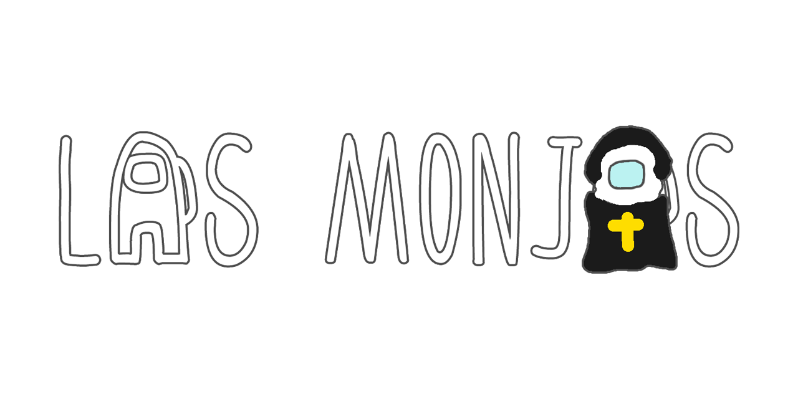

# 目录

- [前言](#前言)
  - [Among Us](#among-us)
  - [提醒](#提醒)
- [模组](#模组)
  - [1.TheOtherRoles V4.2.0（最新支持2022.10.25）(持续更新中)](#1theotherroles-v420最新支持20221025持续更新中)
  - [2.TheOtherRoles GM v3.5.5.1（最新支持2022.3.29）（断更）](#2theotherroles-gm-v3551最新支持2022329断更)
  - [3.TheOtherRoles GM-Haoming v2.3.133（最新支持2022.10.25）(持续更新中)](#3theotherroles-gm-haoming-v23133最新支持20221025持续更新中)
  - [4.TownOfImpostors v2.0.8（最新支持2021.6.15版本）(断更)](#4townofimpostors-v208最新支持2021615版本断更)
  - [5.TownOfUs v3.1.1 (非官方延续) (最新支持2021.12.15) (断更)](#5townofus-v311-非官方延续-最新支持20211215-断更)
  - [6.TownOfUs-R v3.4.0  (支持2022.10.25）](#6townofus-r-v340--支持20221025)
  - [7.TheEpicRoles  v1.1.2（支持2022.2.24s）(断更)](#7theepicroles--v112支持2022224s断更)
  - [8.Las Monjas V3.0.1（适合2022.10.25）(持续更新中)](#8las-monjas-v301适合20221025持续更新中)
  - [9.ExtremeRoles v4.0.0.2 （最新支持2022.10.25) (持续更新中)](#9extremeroles-v4002-最新支持20221025-持续更新中)
  - [10.Nebula On The Ship v1.16.1（支持2022.10.25）(持续更新中)](#10nebula-on-the-ship-v1161支持20221025持续更新中)
  - [11.Peasmod v3.0.0-pre2.2（支持2022.3.29s）（断更）](#11peasmod-v300-pre22支持2022329s断更)
  - [12.国际象棋模组v1.1.1版本（支持2021.6.30版本）（断更)](#12国际象棋模组v111版本支持2021630版本断更)
  - [13.挑战者模组4.3.2（支持2020.6.15s）（断更）](#13挑战者模组432支持2020615s断更)
  - [14.Syyreth ModsAmongUs v4.0.6版本（支持2022.8.24）（断更）](#14syyreth-modsamongus-v406版本支持2022824断更)
  - [15.Cursed-Among-Us v1.1.0 （支持2021.6.30）（断更）](#15cursed-among-us-v110-支持2021630断更)
  - [16.skeld.net (支持大部分版本)](#16skeldnet-支持大部分版本)
  - [17.哈利波特模组 v1.2.0（最新支持2021.5.10s） (断更)](#17哈利波特模组-v120最新支持2021510s-断更)
  - [18.SuperNewRoles](#18supernewroles)
  - [19.TheOtheRoles CE](#19theotherroles-ce)
  - [20.TheOtherRoles MR](#20theotherroles-mr)
  - [21.TownOfHost](#21townofhost)
  - [22.TownOfHost-TheOtherRoles](#22townofhost--theotherroles)
  - [23.BetterTownOfUS](#23bettertownofus)
  - [24.UltimateMods](#24ultimatemods)
  - [25.PropHunt](#25prophunt)
- [工具](#工具)
  - [１.crewlink游戏聊天工具 v2.0.1  (支持版本v2021.11.9.2s)（断更）](#１crewlink游戏聊天工具-v201--支持版本v20211192s断更)
  - [２.BetterCrewLink更好的近距离聊天工具 v3.0.5  (支持大部分Among Us版本) （持续更新中）](#２bettercrewlink更好的近距离聊天工具-v305--支持大部分among-us版本-持续更新中)
  - [３.Among Us回放模组 v2.0.3 (支持任意版本) (断更)](#３among-us回放模组-v203-支持任意版本-断更)
  - [４.模组管理器 v5.1.2 ModManager (持续更新中)](#４模组管理器-v512-modmanager-持续更新中)
  - [5.levelimposter-editor](#5levelimposter-editor)
- [地图](#地图)
  - [１.潜艇地图Submerged v2022.10.26 (支持2022.10.25) (持续更新中)](#１潜艇地图submerged-v20221026-支持20221025-持续更新中)
  - [2.levelimposter](#2levelimposter)
- [多语言样式声明](#多语言样式声明)
  - [简体中文（SChinese）](#简体中文schinese)
  - [繁體中文（TChinese）](#繁體中文tchinese)
  - [Français（French）](#françaisfrench)
  - [English](#english)
  - [日本語（Japanese）](#日本語japanese)
  - [Русский（Russian）](#русскийrussian)
  - [Deutsch（German）](#deutschgerman)
  - [Español（Spanish）](#españolspanish)

# 前言

这是关于Among Us(中文译名：我们之间 俗称：太空狼人杀)这款游戏的中文模组指南

###### Among Us

《Among Us》是一款由Innersloth制作发行的策略休闲游戏。

当您在飞船上前往您要去的地方时，可与4-15名玩家一起在线或通过局域网联机。但是要当心……因为船上可能有伪装者。一到三名船员已被伪装者所取代（内鬼）。他们的目标是在船返航前消灭其余船员。伪装者将破坏船只，潜入通风管道，欺骗其他人以保持自己安全并杀死船员。当每个人都在修理设施时，没有人可以保持匿名。一旦报告了尸体，幸存的船员将公开辩论他们认为“伪装者”是谁。伪装者的目的是假装他们是船员。如果不投票，则每个人都将继续维护该船，直到找到另一具尸体或召开紧急会议为止。如果伪装者被投票投出，那么船员将获胜。

###### 提醒

随着Among Us版本更新官方服务器所支持的服务器也在更新，过老版本只能使用私服才可游玩。

[返回目录](#目录)

# 模组

## 1.TheOtherRoles V4.2.0（最新支持2022.10.25）(持续更新中)

支持与潜艇地图融合游玩！ 
[github地址（点这）](https://github.com/TheOtherRolesAU/TheOtherRoles)

| Impostors         | 内鬼职业         | Crewmates      | 船员职业 | Crewmates   | 船员职业 | Neutral    | 中立职业 |
| ----------------- | ---------------- | -------------- | -------- | ----------- | -------- | ---------- | -------- |
| Evil Guesser      | 坏堵怪           | Nice Guesser   | 好赌怪   | Swapper     | 换票师   | Jester     | 小丑     |
| Bounty Hunter     | 赏金猎人         | Detective      | 侦探    | Time Master | 时间之主 | Jackal     | 豺狼     |
| Camouflager       | 隐蔽者           | Engineer       | 工程师   | Tracker     | 追踪者   | Sidekick   | 跟班     |
| Cleaner           | 清洁工           | Hacker         | 黑客     | Medium      | 通灵师   | Vulture    | 秃鹫     |
| Eraser            | 抹除者           | Lighter        | 执灯人   | Portalmaker | 传送师   | Lawyer     | 律师     |
| Godfather (Mafia) | 教父（黑手党）   | Mayor          | 市长     |             |          | Arsonist   | 纵火犯   |
| Mafioso (Mafia)   | 黑手党（黑手党） | Medic          | 医生     |             |          | Thier      | 小偷     |
| Janitor (Mafia)   | 清洁工（黑手党） | Security Guard | 保安     |             |          | Pursuer    | 追随者   |
| Morphling         | 变形者           | Seer           | 灵媒     |             |          | Prosecutor | 检察官   |
| Trickster         | 骗术师           | Sheriff        | 警长     |             |          |            |          |
| Vampire           | 吸血鬼           | Deputy         | 捕快     |             |          |            |          |
| Warlock           | 术士             | Shifter        | 交换师   |             |          |            |          |
| Witch             | 女巫             | Snitch         | 告密者   |             |          |            |          |
| Ninja             | 忍者             | Spy            | 间谍     |             |          |            |          |

| Neutral    | 中立职业 | Secondary     | 属性   | Gamemode     | 游戏模式 |
| ---------- | -------- | ------------- | -------- | ------------ | -------- |
| Jester     | 小丑     | Lover         | 恋人     | Classic      | 诸神之战 |
| Jackal     | 豺狼     | Mini          | 迷你船员   | Guesser      | 赌怪模式 |
| Sidekick   | 跟班     | VIP           | VIP      | Hide 'n Seek | 躲猫猫   |
| Vulture    | 秃鹫     | Bloody        | 溅血者   |              |          |
| Lawyer     | 律师     | Anti Teleport | 醉鬼     |              |          |
| Arsonist   | 纵火犯   | Tie Breaker   | 通讯兵   |              |          |
| Thier      | 小偷     | Sunglasse     | 太阳镜   |              |          |
| Pursuer    | 陷阱师   | Invert        | 破平者   |              |          |
| Prosecutor | 检察官   |               |          |              |          |

[返回目录](#目录)

***

## 2.TheOtherRoles GM v3.5.5.1（最新支持2022.3.29）（断更）

[github地址（点这）](https://github.com/yukinogatari/TheOtherRoles-GM)

GM是管理员模式，一般作为裁判存在，普通模式不建议开启。

| Impostors         | 内鬼职业         | Crewmates      | 船员职业 | Neutral          | 中立职业    |
| ----------------- | ---------------- | -------------- | -------- | ---------------- | ----------- |
| Evil Mini         | 坏小人           | Nice Mini      | 好小人   | Arsonist         | 纵火犯      |
| Evil Guesser      | 赌怪             | Nice Guesser   | 好赌怪   | Jester           | 小丑        |
| Bounty Hunter     | 赏金猎人         | Detective      | 侦探    | Jackal           | 豺狼        |
| Camouflager       | 隐蔽者           | Engineer       | 工程师   | Sidekick         | 跟班        |
| Cleaner           | 清洁工           | Hacker         | 黑客     | Lover            | 恋人        |
| Eraser            | 抹除者           | Lighter        | 小灯人   | Opportunist      | 投机主义者   |
| Godfather (Mafia) | 教父（黑手党）   | Mayor          | 市长     | Vulture          | 秃鹫        |
| Mafioso (Mafia)   | 黑手党（黑手党） | Medic          | 医生     | Lawyer           | 律师        |
| Janitor (Mafia)   | 清洁工（黑手党） | Security Guard | 保安     | Chain-Shifter    | 连环交换师  |
| Morphling         | 变形者           | Seer           | 灵媒     | Plague Doctor    | 疫医      |
| Trickster         | 骗术师           | Sheriff        | 警长     | Fox & Immoralist | 狐妖&背德者 |
| Vampire           | 吸血鬼           | Shifter        | 交换者   |                  |             |
| Warlock           | 术士             | Snitch         | 告密者   |                  |             |
| Witch             | 女巫             | Spy            | 间谍     |                  |             |
| Ninja             | 忍者             | Nice Swapper   | 好换票师 |                  |             |
| Evil Swapper      | 坏换票师         | Time Master    | 时间之主 |                  |             |
| Serial Killer     | 嗜血杀手         | Tracker        | 追踪者   |                  |             |
| Neko-Kabocha      | 复仇者           | Bait           | 诱饵     |                  |             |
| Evil Watcher      | 坏观察者         | Madmate        | 通灵师   |                  |             |
|                   |                  | Fortune Teller | 算命先生 |                  |             |
|                   |                  | Nice Watcher   | 观察者  |                  |             |

[返回目录](#目录)

***

## 3.TheOtherRoles GM-Haoming v2.3.133（最新支持2022.10.25）(持续更新中)

[github地址（点这）](https://github.com/haoming37/TheOtherRoles-GM-Haoming)

与潜艇地图兼容  
地图改动(Polus) ：  
你可以设置随机重生地点  
附加额外通风口（出生点-脉搏室-右下角样本室）  
可以设置心电图在右下角样本室  
地图改动（airship）  
在任务中增加墙壁检查(飞艇)#来自AuShipMod的创意  

在GM版本基础上新增职业如下：

| 内鬼                | 船员     | 中立       |
| ------------------- | -------- | ---------- |
| 邪恶的黑客          | 占卜师   | 狐妖       |
| 邪恶的追踪者        | 幻视者   | 背德者     |
| 设陷者              | 福尔摩斯 | 薛定谔的猫 |
| 模仿者（杀手/助手） |          | 傀儡师     |
| 双子爆破者A/B       |          | 魅魔       |
| 嗜血杀手            |          | 莫里亚蒂   |
| 绝境者              |          | 丘比特     |
|                     |          | 化身博士   |

[返回目录](#目录)

***

## 4.TownOfImpostors v2.0.8（最新支持2021.6.15版本）(断更)

[github地址（点这）](https://github.com/Town-of-Impostors/TownOfImpostors)

| Crewmate Team | 船员职业 | Impostor  | 内鬼职业 | Other Teams | 其他职业 | Modifiers | 其他效果 |
| ------------- | -------- | --------- | -------- | ----------- | -------- | --------- | -------- |
| Sheriff       | 警长     | Dragger   | 拖拽者   | Jester      | 小丑     | Lovers    | 恋人     |
| Doctor        | 医生     | Morphling | 变形者   | Arsonist    | 纵火犯   | Giant     | 巨人     |
| Agent         | 代理人   | Deceiver  | 欺骗者   |             |          | Tiny      | 迷你船员   |
| Detective     | 调查员   | Viper     | 毒蛇     |             |          | Nightowl  | 执灯人   |
| Plumber       | 管道工   | Sniper    | 狙击手   |             |          |           |          |
| Informant     | 告密者   |           |          |             |          |           |          |
| Trickster     | 诱饵     |           |          |             |          |           |          |
| Operative     | 特务     |           |          |             |          |           |          |
| Mayor         | 市长     |           |          |             |          |           |          |

[返回目录](#目录)

***

## 5.TownOfUs v3.1.1 (非官方延续) (最新支持2021.12.15) (断更)

[github地址（点这）](https://github.com/Anusien/Town-Of-Us)  
[最开始的我们的小镇](https://github.com/slushiegoose/Town-Of-Us)  
  

| Crewmate Roles | 船员职业 | Neutral Roles | 中立职业 | Impostor Roles | 内鬼职业 | Modifiers    | 附加属性 |
|----------------|------|---------------|------|----------------|------|--------------|------|
| Mayor          | 市长   | Jester        | 小丑   | Janitor        | 清洁工  | Torch        | 火炬   |
| Lovers         | 恋人   | Shifter       | 交换师  | Morphling      | 化形者  | Diseased     | 病人   |
| Sheriff        | 警长   | The Glitch    | 混沌   | Camouflager    | 隐蔽者  | Flash        | 闪电侠  |
| Engineer       | 工程师  | Executioner   | 处刑人  | Miner          | 管道工  | Tiebreaker   | 破平者  |
| Swapper        | 换票师  | Arsonist      | 纵火犯  | Swooper        | 俯冲者  | Drunk        | 醉鬼   |
| Investigator   | 调查员  | Phantom       | 幻影   | Underdog       | 潜伏者  | Giant        | 巨人   |
| Time Lord      | 时间之主 |               |      | Undertaker     | 送葬者  | Button Barry | 执钮者  |
| Medic          | 医生   |               |      | Teleporter     | 传送者  | Coroner      | 掘墓人  |
| Seer           | 预言家 |               |      | Concealer      | 隐身人  | Carnivore    | 掘墓内鬼 |
| Spy            | 间谍   |               |      | Grenadier      | 掷弹兵  |              |      |
| Snitch         | 告密者  |               |      |                |      |              |      |
| Altruist       | 殉道者  |               |      |                |      |              |      |
| Prophet        | 侧写师  |               |      |                |      |              |      |
| Covert         | 隐秘者  |               |      |                |      |              |      |
| Lighter        | 执灯人  |

[返回目录](#目录)

***

## 6.TownOfUs-R v3.4.0  (支持2022.10.25）

已支持潜艇地图  
[github地址（点这）](https://github.com/eDonnes124/Town-Of-Us-R)  

| Crewmate Roles | 船员职业 | Neutral Roles  | 中立职业 | Impostor Roles | 内鬼职业 | Modifiers    | 附加属性 |
|----------------|------|----------------|------|----------------|------|--------------|------|
| Detective      | 侦探   | Amnesiac       | 失忆者  | Escapist       | 逃逸者  | Bait         | 诱饵   |
| Haunter        | 猎人   | Guardian Angel | 守护天使 | Grenadier      | 掷弹兵  | Blind        | 胆小鬼  |
| Investigator   | 调查员  | Survivor       | 幸存者  | Morphling      | 化形者  | Diseased     | 病人   |
| Mystic         | 灵媒   | Executioner    | 处刑人  | Swooper        | 隐身人  | Multitasker  | 多线程  |
| Seer           | 预言家  | Jester         | 小丑   | Poisoner       | 绝命毒师 | Torch        | 火炬   |
| Snitch         | 告密者  | Phantom        | 幻影   | Traitor        | 叛徒   | Button Barry | 执钮人  |
| Spy            | 间谍   | Arsonist       | 纵火犯  | Blackmailer    | 勒索者  | Flash        | 闪电侠  |
| Tracker        | 追踪者  | Plaguebearer   | 疫医   | Janitor        | 清理者  | Giant        | 巨人   |
| Trapper        | 陷阱师  | The Glitch     | 混沌   | Miner          | 管道工  | Radar        | 雷达   |
| Sheriff        | 警长   | Werewolf       | 豺狼   | Undertaker     | 送葬者  | Lovers       | 恋人   |
| Veteran        | 老兵   |                |      |                |      | Sleuth       | 掘墓人  |
| Vigilante      | 警员   |                |      |                |      | Tiebreaker   | 破平者  |
| Altruist       | 殉道者  |                |      |                |      | Disperser    | 分散者  |
| Medic          | 医生   |                |      |                |      | Double Shot  | 专业刺客 |
| Engineer       | 工程师  |                |      |                |      | Underdog     | 潜伏者  |
| Mayor          | 市长   |                |      |                |      |              |      |
| Medium         | 通灵师  |                |      |                |      |              |      |
| Swapper        | 换票师  |                |      |                |      |              |      |
| Time Lord      | 时间之主 |                |      |                |      |              |      |
| Transporter    | 传送师  |

[返回目录](#目录)

***

## 7.TheEpicRoles  v1.1.2（支持2022.2.24s）(断更)

[github地址（点这）](https://github.com/LaicosVK/TheEpicRoles)  
  
新特点：  
1.上一场比赛中最先死亡的玩家将在下一场比赛中获得首杀盾。 
2.就绪状态：当有一个人未准备好时，大厅主持人无法开始游戏。 
3.定制鼠标光标。 
4.模组选项类别分类。 
5.运输船不再抖动。 

| Impostors         | 内鬼     | Crewmates      | 船员     | Neutral  | 中立   |  |
| ----------------- | -------- | -------------- | -------- | -------- | ------ | - |
| Evil Mini         | 坏小人   | Nice Mini      | 好小人   | Arsonist | 纵火犯 |  |
| Evil Guesser      | 坏赌怪   | Nice Guesser   | 好赌怪   | Jester   | 小丑   |  |
| Bounty Hunter     | 赏金猎人 | Detective      | 调查员   | Jackal   | 豺狼   |  |
| Camouflager       | 隐蔽者   | Engineer       | 工程师   | Sidekick | 跟班   |  |
| Cleaner           | 清洁工   | Hacker         | 黑客     | Vulture  | 秃鹫   |  |
| Eraser            | 抹除者   | Lighter        | 小灯人   | Lawyer   | 律师   |  |
| Godfahter (Mafia) | 教父     | Mayor          | 市长     | Lover    | 恋人   |  |
| Mafioso (Mafia)   | 黑手党   | Medic          | 医生     |          |        |  |
| Janitor (Mafia)   | 清洁工   | Security Guard | 保安     |          |        |  |
| Morphling         | 变形者   | Seer           | 灵媒     |          |        |  |
| Trickster         | 骗术师   | Sheriff        | 警长     |          |        |  |
| Vampire           | 吸血鬼   | Deputy         | 捕快     |          |        |  |
| Warlock           | 术士     | Shifter        | 交换师   |          |        |  |
| Witch             | 女巫     | Snitch         | 告密者   |          |        |  |
| Phaser            |          | Spy            | 间谍     |          |        |  |
|                   |          | Swapper        | 换票师   |          |        |  |
|                   |          | Time Master    | 时间之主 |          |        |  |
|                   |          | Tracker        | 追踪者   |          |        |  |
|                   |          | Bait           | 诱饵     |          |        |  |
|                   |          | Medium         | 通灵师   |          |        |  |
|                   |          | Jumper         |          |          |        |  |

[返回目录](#目录)

## 8.Las Monjas V3.0.1（适合2022.10.25）(持续更新中)

与潜艇地图兼容  
[github地址（点这）](https://github.com/KiraYamato94/LasMonjas)  

| GameModes | CaptureTheFlag | PoliceAndThiefs | KingOfTheHill | Hot Potato | Zombie Laboratory |
| --------- | -------------- | --------------- | ------------- | ---------- | ----------------- |
| 游戏模式  | 夺旗模式       | 警察抓小偷      | 山丘之王      | 热土豆     | 僵尸实验室        |

| Impostors   | 内鬼职业 | Crewmates      | 船员职业 | Neutrals        | 中立职业 | Modifiers      | 效果     |
| ----------- | -------- | -------------- | -------- | --------------- | -------- | -------------- | -------- |
| Mimic       | 变形者   | Captain        | 船长     | Joker           | 小丑     | Lovers         | 恋人     |
| Painter     | 隐蔽者   | Mechanic       | 工程师   | Role Thief      | 交换师   | Lighter        | 小灯人   |
| Demon       | 吸血鬼   | Sheriff        | 警长     | Pyromaniac      | 纵火犯   | Blind          | 失明者   |
| Janitor     | 清理者   | Detective      | 侦探     | Treasure Hunter | 寻宝猎人 | Flash          | 闪电侠   |
| Ilusionist  | 骗术师   | Forensic       | 法医     | Devourer        | 秃鹫     | Big Chungus    | 巨人     |
| Manipulator | 术士     | Time Traveler  | 时间之主 | Poisoner        |          | The Chosen One | 天选之子 |
| Bomberman   | 爆破者   | Squire         | 医生     | Puppeteer       |          | Performer      | 演员     |
| Chameleon   | 隐形人   | Cheater        | 换票师   | Rebels          | 叛军职业 | Pro            |          |
| Gambler     | 赌徒     | Fortune Teller | 预言家   | Renegade        | 豺狼     |                |          |
| Sorcerer    | 女巫     | Hacker         | 黑客     | Bounty Hunter   | 赏金猎人 |                |          |
| Medusa      | 美杜莎   | Sleuth         | 追踪者   | Trapper         | 陷阱师   |                |          |
| Hypnotist   |          | Fink           | 告密者   | Yinyanger       | 阴阳师   |                |          |
| Archer      |          | Kid            | 小孩     | Challenger      | 挑战者   |                |          |
|             |          | Welder         | 焊接工   | Ninja           | 忍者     |                |          |
|             |          | Spiritualist   | 殉道者   | Berserker       |          |                |          |
|             |          | Vigilant       | 保安     |                 |          |                |          |
|             |          | Coward         | 诱饵     |                 |          |                |          |
|             |          | Bat            |          |                 |          |                |          |
|             |          | Hunter         | 猎人     |                 |          |                |          |
|             |          | Jinx           | 倒霉蛋   |                 |          |                |          |
|             |          | Necromancer    |          |                 |          |                |          |
|             |          | Engineer       |          |                 |          |                |          |
|             |          | Shy            |          |                 |          |                |          |

千年隼号地图展示：

[返回目录](#目录)

## 9.ExtremeRoles v4.0.0.2 （最新支持2022.10.25) (持续更新中)

[github地址（点这）](https://github.com/yukieiji/ExtremeRoles)

[返回目录](#目录)

## 10.Nebula On The Ship v1.16.1（支持2022.10.25）(持续更新中)

原版链接: https://github.com/Dolly1016/Nebula

| Impostors    | 内鬼     | Crewmates    | 船员 | Neutral     | 中立     | Secondary | 附带属性 |
| ------------ | -------- | ------------ | ---- | ----------- | -------- | --------- | -------- |
| Camouflager  | 隐蔽者   | Agent        |      | Arsonist    | 纵火     | Drunk     |          |
| Cleaner      | 清理着   | Alien        |      | Avenger     |          | Guesser   |          |
| Damned       |          | Bait         |      | Empiric     |          | Lover     | 恋人     |
| Disturber    |          | Comet        |      | Jackal      | 豺狼     | Trilemma  |          |
| Eraser       | 抹除者   | Doctor       | 医生 | Jester      | 小丑     |           |          |
| Evil Ace     |          | Mayor        | 市长 | Opportunist | 投机主义 |           |          |
| Evil Guesser | 邪恶赌怪 | Navvy        |      | Sidekick    | 跟班     |           |          |
| Evil Trapper |          | Necromancer  |      | Vulture     | 秃鹫     |           |          |
| Morphing     | 变形者   | Nice Guesser | 赌怪 |             |          |           |          |
| Reaper       |          | Nice Trapper |      |             |          |           |          |
| Sniper       |          | Oracle       |      |             |          |           |          |
|              |          | Provocateur  |      |             |          |           |          |
|              |          | Psychic      |      |             |          |           |          |
|              |          | Seer         |      |             |          |           |          |
|              |          | Sheriff      | 警长 |             |          |           |          |
|              |          | Spy          |      |             |          |           |          |
|              |          | Madmate      | 叛徒 |             |          |           |          |

[返回目录](#目录)

## 11.Peasmod v3.0.0-pre2.2（支持2022.3.29s）（断更）

[github地址（点这）](https://github.com/Dolly1016/Nebula)

| Crewmate Roles | 船员职业 | Impostor Roles | 内鬼职业 | Neutral Roles | 中立职业 | GameModes     | 其他模式 |
| -------------- | -------- | -------------- | -------- | ------------- | -------- | ------------- | -------- |
| Captain        | 船长     | Builder        | 建筑工   | Jester        | 小丑     | BattleRoyale  | 大乱斗   |
| Demon          | 恶魔     | Glaciater      | 冷冻人   | Troll         | 小鬼     | Hide and Seek | 躲猫猫   |
| Doctor         | 医生     | Janitor        | 清理者   |               |          | God Impostor  | 上帝内鬼 |
| Inspector      | 调查员   | Ninja          | 忍者     |               |          |               |          |
| Mayor          | 市长     | Undertaker     | 刺客     |               |          |               |          |
| Sheriff        | 警长     |                |          |               |          |               |          |

[返回目录](#目录)

## 12.国际象棋模组v1.1.1版本（支持2021.6.30版本）（断更)

[github地址（点这）](https://github.com/KyleSmith0905/Among-Chess)

[返回目录](#目录)

## 13.挑战者模组4.3.2（支持2020.6.15s）（断更）

[github地址（点这）](https://github.com/Lunastellia/Challenger-Among-Us)

[返回目录](#目录)

## 14.Syyreth ModsAmongUs v4.0.6版本（支持2022.8.24）（断更）

[github地址（点这）](https://github.com/Syyreth/ModsAmongUs)

  

| Crewmate Roles: | 船员职业 | Neutral Roles: | 中立职业 | Impostor Roles: | 内鬼职业 | Coven Roles:  | 巫师团   |
| --------------- | -------- | -------------- | -------- | --------------- | -------- | ------------- | -------- |
| V.I.P           | VIP      | Executioner    |          | Janitor         | 清理者   | Witch         | 女巫     |
| Captain         | 船长     | Jester         | 小丑     | Morpher         | 变形者   | Medusa        | 美杜莎   |
| Vigilante       | 警长     | Phantom        |          | Spy             | 间谍     | Potion Master | 药剂师   |
| Guardian        | 保安     | Arsonist       | 纵火犯   | Consort         |          | Necromancer   | 死灵法师 |
| Investigator    | 调查员   | Ghoul          |          | The Stealth     |          | Hex Master    |          |
| Swapper         | 换票师   | Plaguebearer   |          | Graverobber     |          | Poisoner      | 毒药师   |
| Engineer        | 工程师   | Angel          | 天使     | FlashBang       |          |               |          |
| Visionary       |          | Serial Killer  | 连环杀手 | Blackmailer     |          |               |          |
| Chronos         |          | Survivor       |          | Bounty Hunter   | 赏金猎人 |               |          |
| Retributionist  | 殉道师   |                |          | AntiTasker      |          |               |          |
| Lookout         |          |                |          | Assassin        | 刺客     |               |          |
| Tracker         | 追踪者   |                |          |                 |          |               |          |
| Pilot           |          |                |          |                 |          |               |          |
| Drainer         |          |                |          |                 |          |               |          |
| Lovers          | 恋人     |                |          |                 |          |               |          |

[返回目录](#目录)

## 15.Cursed-Among-Us v1.1.0 （支持2021.6.30）（断更）

模组链接：https://github.com/Devs-Us/Cursed-Among-Us
  

[返回目录](#目录)

## 16.skeld.net (支持大部分版本)

模组链接：https://skeld.net/

| GameMOD        | 游戏模式   |
| -------------- | ---------- |
| Slenderman     | 瘦长鬼影   |
| Zombies        | 僵尸       |
| Cops & Robbers | 警察抓小偷 |
| Jester         | 小丑       |
| Troll          | 小鬼       |
| Detective      | 侦探       |
| 50-50          | 两组克隆人 |
| CrazyColors:   | 疯狂变色   |
| Twins          | 双胞胎     |
| Clones         | 克隆人     |
| Escalation     | 加速       |
| Standard       | 标准模式   |

[返回目录](#目录)

## 17.哈利波特模组 v1.2.0（最新支持2021.5.10s） (断更)

点评：好玩但由于版本过于老旧，不推荐游玩。

模组链接：https://github.com/FatherofHeathens/HarryPotterAmongUs

| Role      | 职业   | Passive Ability                         | 被动                   | Active Ability                                                                                                                                       | 技能                         |
| --------- | ------ | --------------------------------------- | ---------------------- | ---------------------------------------------------------------------------------------------------------------------------------------------------- | ---------------------------- |
| Harry     | 哈利   | Can not be killed by Voldemort's spell. | 不能被伏地魔的法术杀死 | Can become invisible for 10 seconds.                                                                                                                 | 隐身10秒                     |
| Hermione  | 赫敏   | None.                                   | 无                     | Can teleport themselves back to where they were 10 seconds ago. This can bring the player back to life, unless they are killed by Voldemort's spell. | 传送回10秒前的位置和生命状态 |
| Ron       | 罗恩   | None.                                   | 无                     | Can activate an ability that prevents any spells or kills being used against the player.                                                             | 保护咒抵御法术或者杀戮       |
| Voldemort | 伏地魔 | None.                                   | 无                     | Can shoot a spell that will kill any player it connects with, except Harry; it will kill Voldemort instead.                                          | 阿达瓦索命咒                 |
| Bellatrix | 贝拉   | None.                                   | 无                     | Can shoot a spell that temporarily blinds and freezes any player it connects with.                                                                   | 失明和冻结，钻心咒：心灵控制 |

[返回目录](#目录)

## 18.SuperNewRoles 
[Github仓库(点这)](https://github.com/ykundesu/SuperNewRoles)

## 19.TheOtherRoles CE
[Github仓库(点这)](https://github.com/JustASysAdmin/TheOtherRoles2)

## 20.TheOtherRoles MR
[Github仓库(点这)](https://github.com/miru-y/TheOtherRoles-MR)

## 21.TownOfHost
[Github仓库(点这)](https://github.com/tukasa0001/TownOfHost)

## 22.TownOfHost -TheOtherRoles
[Github仓库(点这)](https://github.com/music-discussion/TownOfHost-TheOtherRoles)
## 23.BetterTownOfUS
[Github仓库(点这)](https://github.com/MC-AS-Huier/Better-Town-Of-Us-R)(原仓库已删除)
.png)

## 24.UltimateMods
[Github仓库(点这)](https://github.com/Dekokiyo/UltimateMods)

## 25.PropHunt
[Github仓库(点这)](https://github.com/ugackMiner53/PropHunt)

# 工具

## １.crewlink游戏聊天工具 v2.0.1  (支持版本v2021.11.9.2s)（断更）

原版链接：https://github.com/ottomated/CrewLink

断更如有需要请使用BetterCrewLink更好的近距离聊天工具

## ２.BetterCrewLink更好的近距离聊天工具 v3.0.5  (支持大部分Among Us版本) （持续更新中）

原版链接：https://github.com/OhMyGuus/BetterCrewlink

已支持中文

注：服务器有问题，需自行搭建语音服务器

## ３.Among Us回放模组 v2.0.3 (支持任意版本) (断更)

原版链接：https://github.com/sawa90/AmongUsReplayInWindow

## ４.模组管理器 v5.1.2 ModManager (持续更新中)

原版链接：https://github.com/MatuxGG/ModManager

[返回目录](#目录)

## 5.LevelImposter-Editor

# 地图

## １.潜艇地图Submerged v2022.10.26 (支持2022.10.25) (持续更新中)

支持潜艇地图的模组的模组作者已将潜艇地图放入模组文件直接下载支持的模组即可  
原版链接:https://github.com/SubmergedAmongUs/Submerged

| 模组                                                                           | ❔ | 程度 |
| ------------------------------------------------------------------------------ | -- | ---- |
| [Las Monjas](https://github.com/KiraYamato94/LasMonjas/)                          | ✅ | 支持 |
| [The Other Roles](https://github.com/TheOtherRoleAU/TheOtherRoles)                | ✅ | 支持 |
| [TheOtherRoles-GM-Haoming](https://github.com/haoming37/TheOtherRoles-GM-Haoming) | ✅ | 支持 |
| [Town-of-Us-R](https://github.com/eDonnes124/Town-Of-Us-R)                        | ✅ | 支持 |
| [ExtremeRoles](https://github.com/yukieiji/ExtremeRoles/)                         | ✅ | 支持 |
| [BetterCrewLink](https://github.com/OhMyGuus/BetterCrewLink)                      | 🟢 | 兼容 |
| [Reactor](https://github.com/nuclearpowered/reactor)                              | 🔗 | 必备 |
| [Region Install](https://github.com/miniduikboot/Mini.RegionInstall)              | 🟢 | 兼容 |

### 与服务器的兼容

| 服务器                                         | ❔ | 支持版本 |
| ---------------------------------------------- | :-: | :------: |
| 官方                                           | ✅ |   支持   |
| [Impostor](https://github.com/Impostor/Impostor/) | ✅ |   支持   |

### 语言的支持
| 语言    | ❔ | 支持情况 |
|-        |:-: |:-:      |
| English | ✅ | 默认    |
| Deutsch | ✅ | 支持    |
| Español | ✅ | 支持    |
| Français | ✅ | 支持   |
| Nederlands | ✅ | 支持 |
| Português (Brasil) | ✅ | 支持 |
| Русский | ✅ | 支持    |
| 日本語 | ✅ | 支持      |
| 简体中文 | ✅ | 支持    |
| 繁體中文 | ✅ | 支持    |
| Bisaya | ❌ | 不支持    |
| Español (Latinoamérica) | ❌ | 不支持|
| Gaeilge | ❌ | 不支持 |
| Italiano | ❌ | 不支持 |
| Português | ❌ | 不支持 |
| 한국어 | ❌ | 不支持 |

[返回目录](#目录)

## 2.LevelImposter

# 多语言样式声明

###### 简体中文（SChinese）

这些模组不隶属于 Among Us 或 Innersloth LLC，其包含的内容也未得到 Innersloth LLC 的认可或以其他方式赞助。此处包含的部分材料是Innersloth LLC的财产。

###### 繁體中文（TChinese）

這些模組不隸屬於 Among Us 或 Innersloth LLC，其包含的內容也未得到 Innersloth LLC 的認可或以其他方式贊助。此處包含的部分材料是Innersloth LLC的財產。

###### Français（French）

Ce mod n'est pas affilié à Among Us ou à Innersloth LLC, et le contenu qu'il contient n'est pas approuvé ou autrement parrainé par Innersloth LLC. Certaines parties des documents contenus dans le présent document sont la propriété d'Innersloth LLC.

###### English

This mod is not affiliated with Among Us or Innersloth LLC, and the content contained therein is not endorsed or otherwise sponsored by Innersloth LLC. Portions of the materials contained herein are property of Innersloth LLC.

###### 日本語（Japanese）

これらのモジュールは、Among UsまたはInnersloth LLCと提携しておらず、Innersloth LLCが承認またはその他の形でスポンサーとなっているコンテンツは含まれていません。 ここに含まれる資料の一部は、Innersloth LLCの所有物です。

###### Русский（Russian）

Эти модули не связаны с Among Us или Innersloth LLC и не содержат контента, который был одобрен или иным образом спонсирован Innersloth LLC. Некоторые из содержащихся здесь материалов являются собственностью Innersloth LLC.

###### Deutsch（German）

Diese Module stehen in keiner Verbindung zu Among Us oder Innersloth LLC und enthalten keine Inhalte, die von Innersloth LLC gebilligt oder anderweitig gesponsert wurden. Ein Teil des hier enthaltenen Materials ist Eigentum von Innersloth LLC.

###### Español（Spanish）

Estos módulos no están afiliados a Among Us ni a Innersloth LLC y no contienen contenido que haya sido respaldado o patrocinado de alguna manera por Innersloth LLC. Parte del material aquí contenido es propiedad de Innersloth LLC.

[返回目录](#目录)
